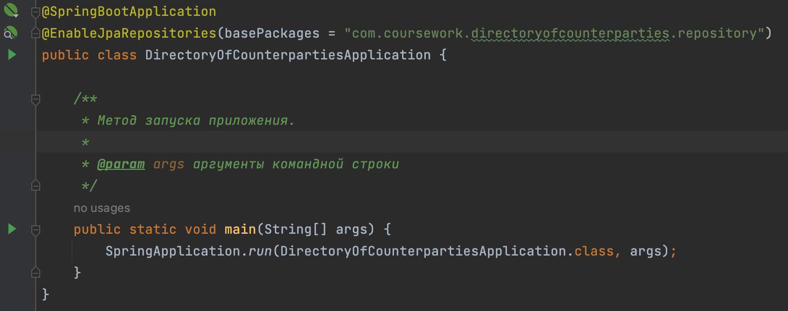
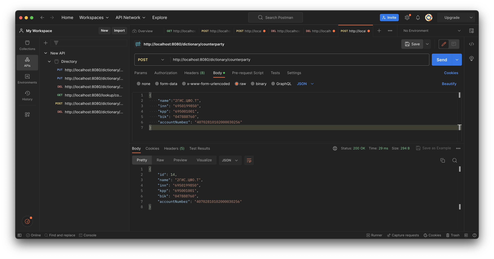
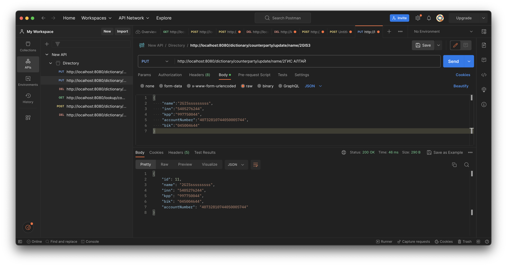
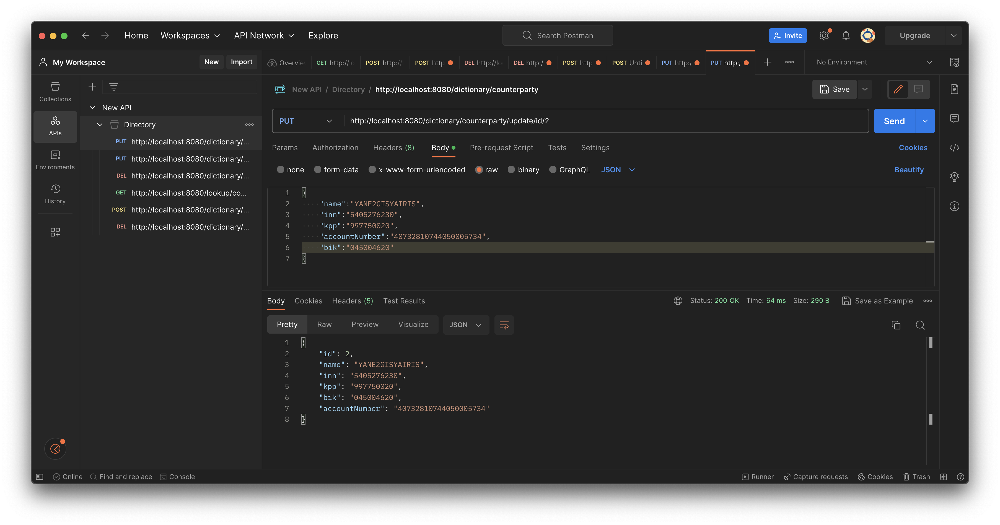
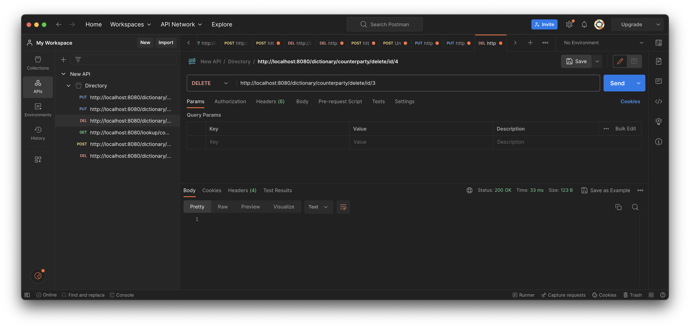
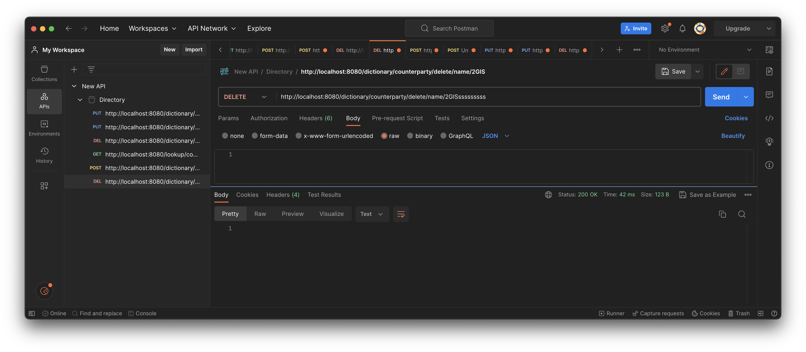
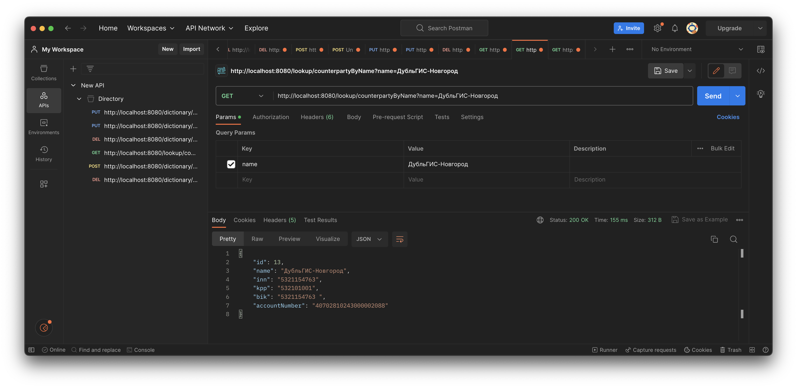
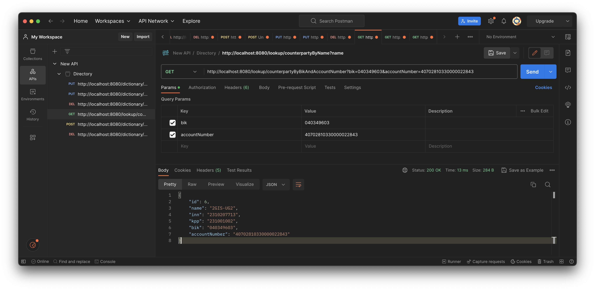

# Справочник контрагентов

## Part 1. Задание

Необходимо разработать модель данных и сервисы для работы со «Справочником контрагентов». Справочник контрагентов должен содержать следующие поля + (уникальный идентификатор в качестве первичного ключа): 

1. Наименование
2. ИНН
3. КПП
4. Номер счёта
5. БИК банка


## Part 2. Валидация

1. ИНН организации - 10-значный и ИНН физического лица или ИП - 12-значный

2. КПП (код причины постановки на учет) состоит из 9 знаков

3. Банковский идентификационный код (сокращенное название БИК) – это уникальный код присваиваемый банку (идентификатор банка) и служащий при проведении платежей на территории Российской Федерации. БИК состоит из 9 цифр: 

```
04 45 25 225
```

* 04 (Россия) Код страны (в данном случае код Российской Федерации – 04)
* 45 (Город Москва) Территориальный код субъекта Российской Федерации по ОКАТО
* 25 (Главное управление) Условный номер подразделения расчетной сети Банка России,
уникальный в рамках территориального учреждения Банка России, в составе которого действует данное подразделение расчетной сети Банка России, или условный номер структурного подразделения Банка России — принимает цифровые значения от 00 до 99
* 225 (ПАО СБЕРБАНК) Условный номер кредитной организации (всегда соответствуют трем последним цифрам в корреспондентском счёте банка и могут принимать значение от 050 до 999)

5. Проверка расчётного счёта, открытого в кредитной организации:
- Для проверки контрольной суммы перед расчётным счётом добавляются три последние цифры БИК банка (итого 23 знака).
- Вычисляется контрольная сумма со следующими весовыми коэффициентами: (7,1,3,7,1,3,7,1,3,7,1,3,7,1,3,7,1,3,7,1,3,7,1)
- Вычисляется контрольное число как остаток от деления контрольной суммы на 10.
- Контрольное число сравнивается с нулём. В случае их равенства расчётный счёт
считается правильным.

6. Наименование ограничим 20 символами.
Уникальное. Двух или более контрагентов с одним и тем же наименованием быть не может

## Part 3. Функицональные требования

1. Добавить эндпоинты для выполнения базовых операций над справочником: добавить\изменить\удалить запись (по ИД, наименованию).
2. Добавить возможность поиска контрагента по
* Наименованию
* По паре БИК + Номер счета

3. API/сервисы:
* работа со справочником (создание/изменение/удаление записей в справочнике) 
* использование справочника (поиск записей в справочнике))


## Part 4. Запуск приложения и подготовка к использованию API

1. Необходимо настроить конфигурацию PostgreSQL в файле 'application.properties' по пути src/main/resources/application.properties

Указать порт, URL, логин и пароль согласно Вашей настройке, например:

```
spring.datasource.url=jdbc:postgresql://localhost:5432/postgres
spring.datasource.username=postgres
spring.datasource.password=postgres
```

2. После настроки базы данных необходимо запустить приложение через функцию main класса DirectoryOfCounterpartiesApplication.java, который лежит по пути src/main/java/com/coursework/directoryofcounterparties/DirectoryOfCounterpartiesApplication.java


*<p align="center">Рис. 1 Функция main<p>*


3. После того, как приложение запущено, необходимо ввести данные в БД (по желанию) для проверки работоспособности API. Данные можно ввести вручную, через Postman или через SQL запрос, например следующего вида: 

```
INSERT INTO counterparties_db (account_number, bik, inn, kpp, name)
VALUES ('40702810185510002701', '040407699', '2224183033', '222401001', 'Городские Информационные Системы'),
        ('40702810825320000024', '042202747', '0268081155', '026801001', '2ГИС.С'),
        ('40702810903500003609', '045004867', '2224208680', '222401001', '2ГИС АЛТАЙ'),
        ('40702810223400002511', '045004774', '5401992859', '540101001', '2ГИС Байкал'),
        ('40702810243000002088', '5321154763 ', '5321154763', '532101001', 'ДубльГИС-Новгород');
```

Убедиться, что записи были добавлены в БД, можно через запрос 

```
SELECT * FROM counterparties_db;
```

## Part 5. Запросы к API

1. Запрос на создание контрагента. Нагляднее всего обратиться к API через Postamn. Для этого необходимо отправить запрос с методом POST, адресом URL http://localhost:8080/dictionary/counterparty, а также указать данные в виде JSON формата. Пример запроса можно увидеть на рисунке 2


*<p align="center">Рис. 2 Создание контрагента<p>*

Если все поля заполнены верно, то результатом ответа должен быть код сообщения "200"

2. Обновление данных по имени контрагента. Нужно создать новый запрос с методом PUT по адрессу http://localhost:8080/dictionary/counterparty/update/name/{имя_контрагента}, а также указать данные, которые Вы хотите изменить. Пример запроса можно увидеть на рисунке 3


*<p align="center">Рис. 3 Обновление контрагента по имени контрагента<p>*

3. Обновление данных по ID контрагента. Небходимо новый запрос с методом PUT по адрессу http://localhost:8080/dictionary/counterparty/update/id/{id}, а также указать данные, которые Вы хотите изменить. Пример запроса можно увидеть на рисунке 4


*<p align="center">Рис. 4 Обновление контрагента по ID<p>*

4. Удаление данных по ID контрагента. Небходимо создать запрос с методом DELETE по адрессу http://localhost:8080/dictionary/counterparty/delete/id/{id}. Пример запроса можно увидеть на рисунке 5


*<p align="center">Рис. 5 Удаление контрагента по ID<p>*

5. Удаление данных по ID контрагента. Небходимо создать запрос с методом DELETE по адрессу http://localhost:8080/dictionary/counterparty/delete/name/{имя_контрагента}. Пример запроса можно увидеть на рисунке 6


*<p align="center">Рис. 6 Удаление контрагента по имени<p>*

6. Поиск контрагента по имени. Небходимо создать запрос с методом GET по адрессу http://localhost:8080/lookup/counterpartyByName?name={имя_контрагента}. Пример запроса можно увидеть на рисунке 7


*<p align="center">Рис. 7  Поиск контрагента по имени<p>*

Если контрагент найден, то в ответе можно посмотреть данные о нем в формате JSON

7. Поиск контрагента по БИК и расчетному счету. Небходимо создать запрос с методом GET по адрессу http://localhost:8080/lookup/counterpartyByBikAndAccountNumber?bik={бик_контрагента}&accountNumber={номер_рассчетного_счета}. Пример запроса можно увидеть на рисунке 8


*<p align="center">Рис. 8  Поиск контрагента по БИК и номеру счета<p>*

## Part 6. Javadoc


Сформировать Javadoc можно через команду
```
mvn javadoc:javadoc
```
Полученный файл лежит по пути targer/site
